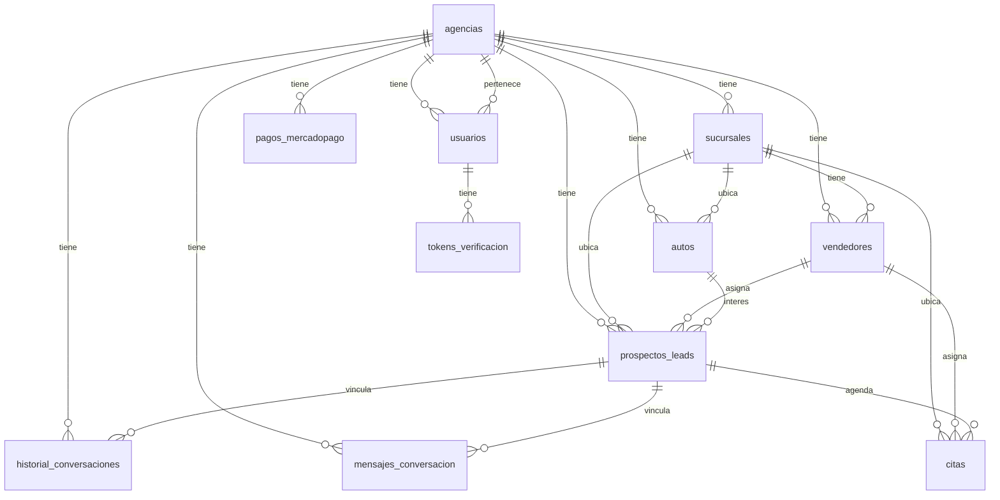

# Reporte técnico — Migración Bot Agencias → Lovable / Supabase

Documento de referencia para reconstruir el sistema en **Lovable** (frontend React) con **Supabase** (PostgreSQL + Auth + Edge Functions) a partir del repositorio actual en GitHub.

**Repositorio origen:** `Javierlw60/Bot-Agencia`  
**Stack actual:** Python 3.10+ · FastAPI · SQLAlchemy · SQLite · Jinja2 · Google Gemini · WhatsApp Cloud API

---

## 1. Arquitectura actual (mapa rápido)

```
app.py                    → Punto de entrada FastAPI, routers, páginas legales
api_whatsapp.py           → Webhook Meta GET/POST /webhook
whatsapp_entrada.py       → Orquestación mensajes WA → bot
bot.py                    → Lógica conversacional + Gemini
inventory.py              → Inventario, leads, ruteo por phone_number_id
models/database.py        → Modelos SQLAlchemy + migraciones inline
dashboard/routes.py       → Panel web (inventario, citas, leads, config)
auth/                     → Registro, login, 2FA, correo SMTP
whatsapp.py               → Envío Graph API (texto/audio)
sesiones_bot.py           → Sesiones en memoria del bot (NO es tabla SQL)
scheduler_tareas.py       → Recordatorios + cron vencimientos
api_mercadopago.py        → Webhook y suscripciones MP
```

### Consideraciones para Lovable

| Aspecto actual | Implicación en Lovable |
|----------------|------------------------|
| SQLite local (`bot_agencias_multitenant.db`) | Migrar a **PostgreSQL en Supabase** |
| Sesiones bot en RAM (`sesiones_bot.py`) | En serverless/edge **no persisten** entre invocaciones; hidratar siempre desde `mensajes_conversacion` + `prospectos_leads` |
| Templates Jinja2 | Reemplazar por UI React en Lovable |
| Webhook + bot en mismo proceso | Ideal: **Supabase Edge Function** o backend dedicado para `/webhook` |
| SMTP propio para verificación | Reemplazar por **Supabase Auth** (magic link / OTP email) |

---

## 2. Esquema de base de datos

Motor actual: **SQLite**. Todas las tablas se crean en `models/database.py` con migraciones `ALTER TABLE` ad hoc al iniciar la app.

### Diagrama de relaciones



---

### 2.1 `agencias` — Tenant principal

| Campo | Tipo | Notas |
|-------|------|-------|
| `id` | INTEGER PK | |
| `nombre` | VARCHAR(100) | Nombre legal/interno |
| `nombre_agencia` | VARCHAR(100) nullable | Marca comercial |
| `nombre_bot` | VARCHAR(80) nullable | Nombre del asesor virtual |
| `whatsapp_phone_number_id` | VARCHAR(50) **UNIQUE** | **Phone Number ID de Meta** (no el 549…) |
| `prompt_personalizado` | TEXT nullable | Directivas extra para Gemini |
| `logo_url` | VARCHAR(500) nullable | |
| `color_primario` | VARCHAR(20) default `#3B82F6` | |
| `direccion` | VARCHAR(200) nullable | |
| `telefono_contacto` | VARCHAR(30) nullable | |
| `fecha_vencimiento` | DATE nullable | Suscripción |
| `estado_pago` | VARCHAR(20) default `activo` | `activo` / suspendido |
| `mp_preapproval_id` | VARCHAR(80) nullable | Mercado Pago |
| `mp_renovacion_automatica` | BOOLEAN default false | |
| `modo_respuesta` | VARCHAR(20) default `texto` | `texto` / `voz` / `ambas` |

---

### 2.2 `sucursales` — Sede física / comercial

| Campo | Tipo | Notas |
|-------|------|-------|
| `id` | INTEGER PK | |
| `agencia_id` | FK → `agencias.id` | |
| `numero` | INTEGER | Orden (1, 2, 3…) |
| `nombre` | VARCHAR(100) | Ej. "Sucursal 1" |
| `nombre_comercial` | VARCHAR(100) nullable | |
| `asesor_virtual_nombre` | VARCHAR(80) nullable | |
| `color_primario` | VARCHAR(20) nullable | |
| `direccion` | VARCHAR(200) nullable | |
| `telefono_whatsapp` | VARCHAR(30) | **Debe ser Phone Number ID de Meta** si se usa para enviar |
| `es_principal` | BOOLEAN default false | |
| `creado_en` | DATETIME | |

---

### 2.3 `vendedores` — Asesor con línea WA propia

Jerarquía: **Agencia → Sucursal → Vendedor**.

| Campo | Tipo | Notas |
|-------|------|-------|
| `id` | INTEGER PK | |
| `agencia_id` | FK → `agencias.id` | |
| `sucursal_id` | FK → `sucursales.id` | |
| `nombre` | VARCHAR(100) | |
| `asesor_virtual_nombre` | VARCHAR(80) nullable | Identidad del bot para este vendedor |
| `nombre_comercial` | VARCHAR(100) nullable | |
| `color_primario` | VARCHAR(20) nullable | |
| `logo_url` | VARCHAR(500) nullable | |
| `telefono_whatsapp` | VARCHAR(30) **UNIQUE** | Línea receptora/envío (ideal: Phone Number ID Meta) |
| `modo_respuesta` | VARCHAR(20) nullable | Override del modo de la agencia |
| `es_principal` | BOOLEAN default false | Vendedor Principal por sucursal |
| `activo` | BOOLEAN default true | |
| `creado_en` | DATETIME | |

---

### 2.4 `autos` — Inventario

| Campo | Tipo | Notas |
|-------|------|-------|
| `id` | INTEGER PK | |
| `agencia_id` | FK → `agencias.id` | |
| `sucursal_id` | FK → `sucursales.id` nullable | |
| `marca`, `modelo`, `version` | VARCHAR | |
| `ano` | INTEGER | |
| `tipo` | VARCHAR(30) | Sedan, SUV, etc. |
| `patente` | VARCHAR(15) | |
| `chasis`, `motor`, `uso` | VARCHAR nullable | |
| `precio_referencia_ars` | NUMERIC(14,2) | |
| `estado` | VARCHAR(20) default `Disponible` | |
| `foto_principal_url` | VARCHAR(500) nullable | |
| `fotos_json` | TEXT nullable | JSON con URLs adicionales |
| `kilometros` | INTEGER nullable | |

---

### 2.5 `prospectos_leads` — Lead comercial

| Campo | Tipo | Notas |
|-------|------|-------|
| `id` | INTEGER PK | |
| `agencia_id` | FK | |
| `sucursal_id` | FK nullable | |
| `vendedor_id` | FK nullable | |
| `telefono_cliente` | VARCHAR(30) | WhatsApp del cliente |
| `nombre_cliente`, `apellido_cliente` | VARCHAR(80) nullable | |
| `auto_interes_id` | FK → `autos.id` nullable | |
| `presupuesto_estimado` | NUMERIC nullable | |
| `usado_*` | varios | Datos de permuta (marca, año, km, patente, etc.) |
| `estado_comercial` | VARCHAR(30) default `Esperando_Llamada` | |
| `fecha_creacion` | DATETIME | |

---

### 2.6 `citas` — Agenda de visitas

| Campo | Tipo | Notas |
|-------|------|-------|
| `id` | INTEGER PK | |
| `cliente_id` | FK → `prospectos_leads.id` | |
| `sucursal_id`, `vendedor_id` | FK nullable | |
| `fecha_cita` | DATE | |
| `hora_cita` | VARCHAR(10) | Formato `HH:MM` |
| `auto_interes` | VARCHAR(150) nullable | |
| `estado` | VARCHAR(20) | Ver estados canónicos abajo |
| `recordatorio_enviado` | BOOLEAN default false | |
| `fecha_creacion` | DATETIME | |

**Estados canónicos de cita** (`estado_cita.py`):

| Clave | Etiqueta |
|-------|----------|
| `pendiente` | Pendiente |
| `en_curso` | En curso |
| `concretada` | Venta concretada |
| `perdida` | Venta perdida |

---

### 2.7 `mensajes_conversacion` — Historial chat (persistente)

| Campo | Tipo | Notas |
|-------|------|-------|
| `id` | INTEGER PK | |
| `agencia_id` | FK | |
| `lead_id` | FK nullable | |
| `telefono_cliente` | VARCHAR(30) | |
| `rol` | VARCHAR(10) | `cliente` / `bot` |
| `contenido` | TEXT | |
| `fecha_creacion` | DATETIME | |

---

### 2.8 `historial_conversaciones` — Auditoría de audios STT

| Campo | Tipo | Notas |
|-------|------|-------|
| `id` | INTEGER PK | |
| `agencia_id` | FK | |
| `cliente_id` | FK nullable | |
| `telefono_cliente` | VARCHAR(30) | |
| `audio_path` | VARCHAR(500) | Ruta local del archivo |
| `audio_url` | VARCHAR(500) nullable | URL pública |
| `transcripcion` | TEXT | |
| `mp_media_id` | VARCHAR(80) nullable | Media ID de Meta |
| `whatsapp_message_id` | VARCHAR(80) nullable | |
| `fecha_creacion` | DATETIME | |

---

### 2.9 `usuarios` — Acceso al panel

| Campo | Tipo | Notas |
|-------|------|-------|
| `id` | INTEGER PK | |
| `email` | VARCHAR(255) UNIQUE | |
| `password_hash` | VARCHAR(255) | bcrypt |
| `nombre` | VARCHAR(100) | |
| `telefono_whatsapp` | VARCHAR(30) | Para 2FA por WA |
| `email_verificado` | BOOLEAN default false | Bloquea login si false |
| `agencia_id` | FK → `agencias.id` | |
| `activo` | BOOLEAN default true | |
| `creado_en` | DATETIME | |

**Usuario demo sembrado:** `admin@demo.local` / `Demo1234` (solo desarrollo).

---

### 2.10 `tokens_verificacion` — Tokens email y 2FA

| Campo | Tipo | Notas |
|-------|------|-------|
| `id` | INTEGER PK | |
| `usuario_id` | FK → `usuarios.id` | |
| `tipo` | VARCHAR(30) | `email_verificacion` / `login_2fa` |
| `codigo_hash` | VARCHAR(64) | SHA-256 del token/código |
| `expira_en` | DATETIME | Email: 24 h · 2FA: 10 min |
| `usado` | BOOLEAN default false | |
| `creado_en` | DATETIME | |

---

### 2.11 `pagos_mercadopago` — Idempotencia webhook MP

| Campo | Tipo | Notas |
|-------|------|-------|
| `id` | INTEGER PK | |
| `agencia_id` | FK | |
| `mp_resource_id` | VARCHAR(80) UNIQUE | |
| `tipo` | VARCHAR(40) | |
| `monto` | NUMERIC nullable | |
| `fecha_procesado` | DATETIME | |

---

### 2.12 Sesión del bot (NO es tabla SQL)

La **sesión conversacional activa** vive en memoria (`sesiones_bot.py` → dict `_sesiones_activas`).

**Dataclass `SesionCliente`** (`bot.py`):

| Campo | Descripción |
|-------|-------------|
| `agencia_id`, `telefono` | Clave de sesión |
| `nombre_cliente`, `apellido_cliente` | Captura progresiva |
| `auto_interes_id`, `presupuesto` | Calificación |
| `usado_*` | Permuta |
| `interes_alto`, `quiere_permuta` | Flags comerciales |
| `lead_id`, `cita_registrada_id` | IDs persistidos |
| `sucursal_origen_id`, `vendedor_origen_id` | Ruteo WA |
| `line_whatsapp_id` | Phone Number ID usado para responder |
| `historial` | Lista `["Cliente: …", "Bot: …"]` (máx. 40 msgs desde BD) |

Al crear sesión se **hidrata** desde `prospectos_leads` + `mensajes_conversacion`.

**En Lovable:** replicar este estado en Supabase o reconstruirlo en cada webhook desde `mensajes_conversacion`.

---

## 3. Lógica del Webhook de WhatsApp

Archivo principal: **`api_whatsapp.py`**. Montado en `app.py` sin prefijo → rutas `/webhook` y `/webhook/whatsapp/{id}` (legacy).

### 3.1 Validación inicial (GET)

Meta envía:

```
GET /webhook?hub.mode=subscribe&hub.verify_token=XXX&hub.challenge=YYY
```

- Compara `hub.verify_token` con `WHATSAPP_VERIFY_TOKEN` (env).
- Si coincide → responde texto plano con `hub.challenge`.
- Si no → HTTP 403.

### 3.2 Recepción de mensajes (POST)

```
POST /webhook
Body: JSON de Meta (whatsapp_business_account)
```

**Flujo paso a paso:**

```
1. recibir_webhook()
   └─ payload = request.json()
   └─ log: POST /webhook recibido
   └─ _procesar_payload_webhook(payload)

2. _procesar_payload_webhook()
   ├─ Si object != "whatsapp_business_account" → ignorar (procesados: 0)
   ├─ _extraer_mensajes(payload)
   │    └─ Recorre entry[].changes[].value.messages[]
   │    └─ Extrae: phone_number_id (metadata), from, type, text, audio_id
   ├─ Si no hay messages[] → "sin_mensajes" (solo statuses delivered/read)
   └─ Por cada mensaje:
        ├─ _resolver_phone_number_id()
        │    Prioridad: metadata.phone_number_id → fallback URL → WHATSAPP_PHONE_NUMBER_ID (.env)
        └─ _procesar_un_mensaje(msg, phone_id)

3. _procesar_un_mensaje()  ← diagnóstico [WEBHOOK WA] agregado
   ├─ _log_diagnostico_ruteo()
   │    ├─ Imprime ID recibido de Meta vs ID usado en BD
   │    ├─ Normaliza ID (solo dígitos) para comparar
   │    ├─ Avisos de formato (ej. parece celular 549… en vez de ID Meta)
   │    └─ Lista todos los IDs en BD (agencias, vendedores, sucursales) con <-- COINCIDE
   ├─ resolver_destino_por_receptor_whatsapp(phone_id)  [inventory.py]
   │    Prioridad de match:
   │      1. Vendedor.telefono_whatsapp == phone_id (exacto o normalizado)
   │      2. Sucursal.telefono_whatsapp == phone_id
   │      3. Agencia.whatsapp_phone_number_id == phone_id
   ├─ Si NO hay agencia → return { motivo: "Agencia no encontrada" } (200 OK, sin respuesta al chat)
   ├─ evaluar_agencia_para_operar() → si suspendida, envía mensaje bloqueo
   ├─ tipo == "text" → procesar_texto_whatsapp()
   ├─ tipo == "audio" → procesar_audio_whatsapp()
   └─ otro tipo → ignorado

4. procesar_texto_whatsapp()  [whatsapp_entrada.py]
   ├─ obtener_o_crear_sesion(agencia_id, telefono)
   ├─ _aplicar_sucursal_sesion() → setea vendedor/sucursal/line_whatsapp_id
   ├─ _enviar_bienvenida_inicial() si historial vacío
   ├─ _procesar_mensaje(..., via_whatsapp=True)  [bot.py + Gemini]
   └─ _finalizar_y_guardar_lead()

5. _entregar_respuesta_whatsapp()  [bot.py]
   ├─ line_id = agencia.whatsapp_phone_number_id
   │   (o sesion.line_whatsapp_id si está seteado ← BUG FRECUENTE si es 549…)
   └─ enviar_respuesta_bot() → POST graph.facebook.com/{line_id}/messages
```

### 3.3 Normalización del Phone Number ID

```python
# api_whatsapp.py
def _normalizar_phone_id(valor):
    return re.sub(r"\D", "", str(valor).strip())

# inventory.py — misma lógica en _normalizar_linea_whatsapp()
```

Comparación en BD: match **exacto** del string O match de versiones **normalizadas** (solo dígitos).

### 3.4 Punto crítico para la migración

| Campo | Debe contener |
|-------|---------------|
| `agencias.whatsapp_phone_number_id` | Phone Number ID de Meta |
| `vendedores.telefono_whatsapp` | Phone Number ID de Meta (no celular 549…) |
| `sucursales.telefono_whatsapp` | Idem |
| `.env WHATSAPP_PHONE_NUMBER_ID` | Fallback si metadata no trae ID |

Si el ID de Meta (`1086244571248216`) no coincide con ningún registro en BD, el webhook responde **200 OK** pero el bot **no contesta**.

### 3.5 Respuesta HTTP al webhook

Meta siempre recibe **200** aunque falle el envío posterior. El cuerpo JSON interno incluye `resultados[]` con el detalle (no siempre logueado en producción).

---

## 4. Variables de entorno

### 4.1 Obligatorias para operación básica

| Variable | Alias | Uso | Default |
|----------|-------|-----|---------|
| `GEMINI_API_KEY` | — | Motor conversacional del bot | — |
| `AUTH_SECRET_KEY` | — | Firma cookies sesión panel + 2FA pendiente | fallback débil con GEMINI |
| `DASHBOARD_BASE_URL` | — | URLs públicas (email, fotos, TTS) | `http://127.0.0.1:8080` |
| `WHATSAPP_MODO` | — | `api` = real · `consola` = solo logs | `consola` |
| `WHATSAPP_ACCESS_TOKEN` | `WHATSAPP_TOKEN` | Token Graph API Meta | — |
| `WHATSAPP_PHONE_NUMBER_ID` | `PHONE_NUMBER_ID` | Phone Number ID Meta | — |
| `WHATSAPP_VERIFY_TOKEN` | `VERIFY_TOKEN` | Validación GET webhook | `bot_agencias_verify` |
| `WHATSAPP_API_VERSION` | — | Versión Graph API | `v21.0` |

### 4.2 Autenticación del panel

| Variable | Uso |
|----------|-----|
| `AUTH_SECRET_KEY` | HMAC cookies `ba_session` y `ba_2fa` |
| `AUTH_WHATSAPP_PHONE_NUMBER_ID` | Línea para códigos 2FA (fallback en `whatsapp_config`) |
| `AUTH_2FA_DEV` | `true` → bypass 2FA en desarrollo |
| `AUTH_DEV_BYPASS` | Alias del anterior |
| `APP_URL` | Detección entorno local (junto con DASHBOARD_BASE_URL) |
| `SMTP_HOST` | Si vacío → email solo se imprime en consola |
| `SMTP_PORT` | Default `587` |
| `SMTP_USER` | |
| `SMTP_PASSWORD` | |
| `SMTP_FROM` | |
| `SMTP_TLS` | Default `true` |

### 4.3 Bot multimedia

| Variable | Uso | Default |
|----------|-----|---------|
| `TTS_VOZ` | Voz edge-tts | `es-AR-ElenaNeural` |
| `TTS_MAX_CARACTERES` | Límite TTS | `1500` |
| `OPENAI_API_KEY` | Whisper STT | — |
| `STT_MOTOR` | `openai` o `local` | `openai` |
| `STT_IDIOMA` | | `es` |
| `STT_MODELO_LOCAL` | faster-whisper | `small` |

### 4.4 Schedulers (background)

| Variable | Uso | Default |
|----------|-----|---------|
| `RECORDATORIOS_ACTIVOS` | Cron recordatorios citas | `true` |
| `RECORDATORIOS_INTERVALO_MIN` | | `15` |
| `VENCIMIENTOS_CRON_ACTIVO` | Bloqueo agencias vencidas | `true` |
| `VENCIMIENTOS_CRON_HORA` | | `6` |
| `VENCIMIENTOS_CRON_MINUTO` | | `0` |

### 4.5 Mercado Pago

| Variable | Uso | Default |
|----------|-----|---------|
| `MERCADOPAGO_ACCESS_TOKEN` | API MP | — |
| `MERCADOPAGO_USER_ID` | | — |
| `MERCADOPAGO_WEBHOOK_SECRET` | Firma webhook | — |
| `MERCADOPAGO_WEBHOOK_VALIDAR` | | `true` |
| `MERCADOPAGO_PLAN_ID` | Plan preapproval opcional | — |
| `MERCADOPAGO_SUSCRIPCION_MONTO` | | `29999` |
| `MERCADOPAGO_MONEDA` | | `ARS` |

### 4.6 Instalación (solo script local, no runtime)

| Variable | Uso |
|----------|-----|
| `SETUP_ADMIN_EMAIL` | Default `admin@demo.local` |
| `SETUP_ADMIN_PASSWORD` | Default `Demo1234` |
| `SETUP_ADMIN_NOMBRE` | |
| `SETUP_ADMIN_WHATSAPP` | |
| `SETUP_PORT` | Puerto sugerido |

### 4.7 Mapa sugerido en Lovable / Supabase

| Secret en Supabase / Lovable | Variables actuales |
|------------------------------|-------------------|
| `GEMINI_API_KEY` | IA del bot |
| `WHATSAPP_ACCESS_TOKEN` | Meta |
| `WHATSAPP_VERIFY_TOKEN` | Meta webhook |
| `WHATSAPP_PHONE_NUMBER_ID` | Meta (por tenant o global) |
| `OPENAI_API_KEY` | STT (opcional) |
| `MERCADOPAGO_ACCESS_TOKEN` | Pagos (opcional) |
| `SUPABASE_SERVICE_ROLE_KEY` | Edge Functions webhook |
| `SUPABASE_URL` | Cliente y funciones |

`AUTH_SECRET_KEY` y SMTP **no serían necesarios** si se usa Supabase Auth nativo.

---

## 5. Flujo de autenticación (actual y simplificación en Lovable)

### 5.1 Registro (`POST /auth/registro`)

```
1. Validar campos (email, password ≥8, teléfono, nombre, nombre_agencia)
2. Crear Agencia (whatsapp_phone_number_id temporal: reg_{hex})
3. Crear Usuario (email_verificado = false)
4. Crear token email_verificacion (hash SHA-256, expira 24 h)
5. commit BD
6. enviar_correo_verificacion()  ← smtplib o print en consola
7. Redirect /auth/registro-enviado  ← SIEMPRE éxito (ignora fallo SMTP)
```

**Problemas actuales:**

- Si `SMTP_HOST` vacío → enlace solo en logs de servidor.
- Si SMTP falla → `return False` pero **nadie lo lee**; usuario ve pantalla de éxito.
- SMTP síncrono bloquea hasta **30 s** (`timeout=30`).
- Cuenta queda con `email_verificado=false` → no puede hacer login.

### 5.2 Verificación de email (`GET /auth/verificar-email?token=…`)

```
1. Buscar tokens_verificacion tipo=email_verificacion, no usado, no expirado
2. Comparar SHA-256(token URL) con codigo_hash
3. usuario.email_verificado = true
4. Redirect /auth/login?ok=email
```

### 5.3 Login (`POST /auth/login`)

```
1. Verificar email + password (bcrypt)
2. Si email_verificado == false → error
3. Modo desarrollo (localhost / admin@demo.local / AUTH_2FA_DEV):
   → ingreso directo al dashboard (sin 2FA)
4. Modo producción:
   → generar código 6 dígitos
   → guardar token login_2fa (10 min)
   → enviar_codigo_2fa() por WhatsApp
   → cookie ba_2fa (pendiente)
   → redirect /auth/verificar-2fa
```

### 5.4 Verificación 2FA (`POST /auth/verificar-2fa`)

```
1. Leer cookie ba_2fa (HMAC firmada con AUTH_SECRET_KEY)
2. Validar código contra tokens_verificacion
3. Crear cookie ba_session (7 días)
4. Redirect /dashboard/{agencia_id}
```

### 5.5 Middleware de rutas protegidas

- Rutas públicas: `/auth`, `/webhook`, `/health`, `/privacy`, `/terms`, `/contacto`, `/static`, `/api/mercadopago`, `/api/bot`
- `/dashboard/{agencia_id}/*` requiere cookie `ba_session` válida
- Usuario debe pertenecer a la agencia solicitada

---

### 5.6 Recomendación simplificada para Lovable + Supabase Auth

| Paso actual | Reemplazo en Lovable |
|-------------|---------------------|
| Registro custom + SMTP | **Supabase Auth signUp** con confirmación por email nativa |
| `tokens_verificacion` email | `auth.users.email_confirmed_at` de Supabase |
| `password_hash` bcrypt manual | Supabase Auth (gestión automática) |
| 2FA por WhatsApp | Opcional: Supabase MFA, o omitir en v1 |
| Cookies `ba_session` HMAC | Supabase session JWT + Row Level Security |
| `usuarios.agencia_id` | Tabla `profiles` o `usuarios` con `user_id` UUID → `agencia_id` |

**Esquema mínimo sugerido en Supabase:**

```sql
-- Perfil vinculado a auth.users
create table profiles (
  id uuid primary key references auth.users(id),
  agencia_id bigint references agencias(id),
  nombre text not null,
  telefono_whatsapp text,
  activo boolean default true
);

-- RLS: usuario solo ve datos de su agencia_id
```

**Flujo v1 sin SMTP ni 2FA:**

1. Sign up en Lovable (Supabase Auth).
2. Confirmar email (Supabase envía el correo).
3. Al primer login, crear o vincular `agencias` + `profiles`.
4. JWT en frontend → API/Edge Functions con `agencia_id`.

---

## 6. Endpoints clave a replicar

| Método | Ruta | Función |
|--------|------|---------|
| GET/POST | `/webhook` | WhatsApp Meta |
| GET | `/health` | Health check |
| GET/POST | `/auth/login`, `/auth/registro` | Auth (reemplazar por Supabase) |
| GET | `/dashboard/{id}` | Panel principal |
| GET | `/dashboard/{id}/inventario` | Stock |
| GET | `/dashboard/{id}/leads` | Leads |
| GET | `/dashboard/{id}/citas` | Agenda + estadísticas |
| GET | `/dashboard/{id}/configuracion` | Sucursales + vendedores |
| POST | `/api/mercadopago/webhook` | Pagos |
| GET | `/privacy`, `/terms`, `/contacto` | Páginas legales Meta |

---

## 7. Dependencias Python relevantes

```
fastapi, uvicorn, sqlalchemy, pydantic, python-dotenv
google-genai          # Gemini
bcrypt                # passwords
edge-tts              # TTS
apscheduler           # crons
jinja2                # templates (no aplica en Lovable UI)
```

---

## 8. Checklist de migración

- [ ] Exportar esquema SQLite → PostgreSQL (Supabase)
- [ ] Reemplazar `whatsapp_phone_number_id` en semillas demo por ID real de Meta
- [ ] Unificar campos `telefono_whatsapp` de vendedor/sucursal como **Phone Number ID**
- [ ] Webhook en Edge Function con logs `[WEBHOOK WA]`
- [ ] Persistir contexto bot en `mensajes_conversacion` (no RAM)
- [ ] Supabase Auth en lugar de SMTP + tokens_verificacion email
- [ ] RLS por `agencia_id` en todas las tablas tenant
- [ ] Subir fotos inventario a **Supabase Storage** (reemplazar `static/uploads`)
- [ ] Configurar secrets Meta + Gemini en Lovable/Supabase
- [ ] Páginas `/privacy`, `/terms`, `/contacto` (requeridas por Meta)

---

## 9. Archivos fuente de referencia

| Tema | Archivo |
|------|---------|
| Modelos BD | `models/database.py` |
| Webhook WA | `api_whatsapp.py` |
| Ruteo agencia | `inventory.py` |
| Bot + Gemini | `bot.py`, `prompts.py` |
| Envío WA | `whatsapp.py`, `whatsapp_config.py` |
| Auth | `auth/servicio.py`, `auth/routes.py`, `auth/correo.py` |
| Sesión bot | `sesiones_bot.py` |
| Estados cita | `estado_cita.py` |
| ENV ejemplo | `.env.example` |

---

*Generado para facilitar la reconstrucción en Lovable. Revisar contra la rama `main` del repositorio antes de implementar.*
